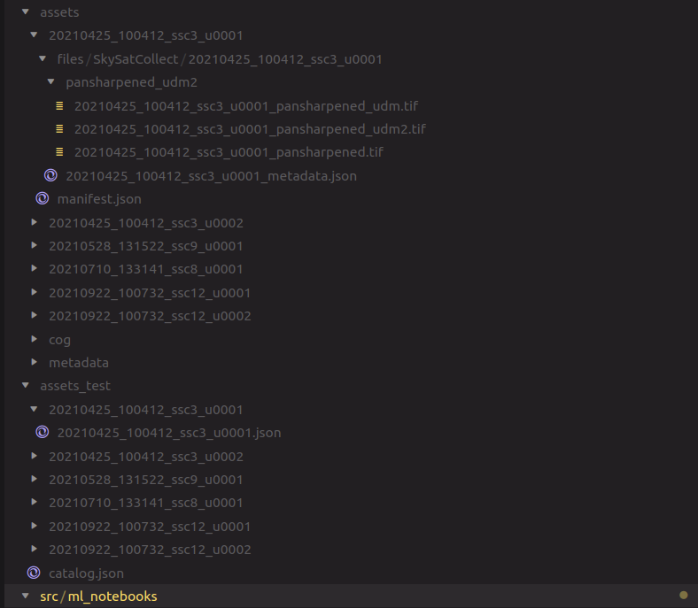

# Ingesting Planet STAC Data

This repository serves as an entry-point into the use of a Spatio-Temporal Asset Catalog (STAC) is, and how it can be used to analyze satellite data.

## Get Started

```bash
git clone git@github.com:alexberndt/planet-stac
cd planet-stac
poetry install
```

Get started with a jupyter notebook by running

```bash
poetry run jupyter-lab
```

## Entrypoints

This repository consists of

1. Jupyter Notebook

   Go to `src/ml_notebooks/stac/stac.ipynb`

## Assets Folder

The assets are saved as follows


