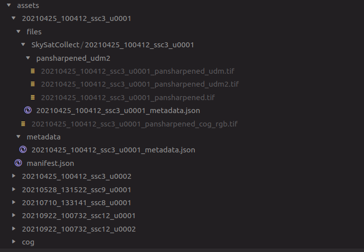

# Ingesting Planet STAC Data

This repository serves as an entry-point into the use of a Spatio-Temporal Asset Catalog (STAC) is, and how it can be used to analyze satellite data.

## Get Started

```bash
git clone git@github.com:alexberndt/planet-stac
cd planet-stac
poetry install
```

Get started with a jupyter notebook by running

```bash
poetry run jupyter-lab
```

## Notebooks

This repository consists of

1. STAC Registry and Querying
   
   1. `src/ml_notebooks/stac/stac.ipynb`
   2. `src/ml_notebooks/stac/read_stac_api.ipynb`

   with helper functions written in a separate file `src/ml_notebooks/stac/helper.py` to aide with code readability.

   > Although `catalog.validate()` passed all checks, I was struggling to query data using the `pystac_client` tool. Any idea as to what I was doing wrong?

   To avoid being blocked by this, I used a publicly available STAC catalog to test STAC queries with (see `read_stac_api.ipynb` notebook).

2. Exploration of Provided Satellite Data

   1. `src/ml_notebooks/stac/explore_data.ipynb`

3. Monthly Mosaic

   1. `src/ml_notebooks/conda/monthly_mosaic.ipynb`

   > As mentioned above, I was struggling getting the STAC queries to work without error, so ended up testing the _coiled_-based cloud cluster using the example STAC provided by Planetary Computer. The results are documented in this notebook:

   1. `src/ml_notebooks/conda/median_mosaic.ipynb`
   

## Assets Folder

The assets are saved as follows


